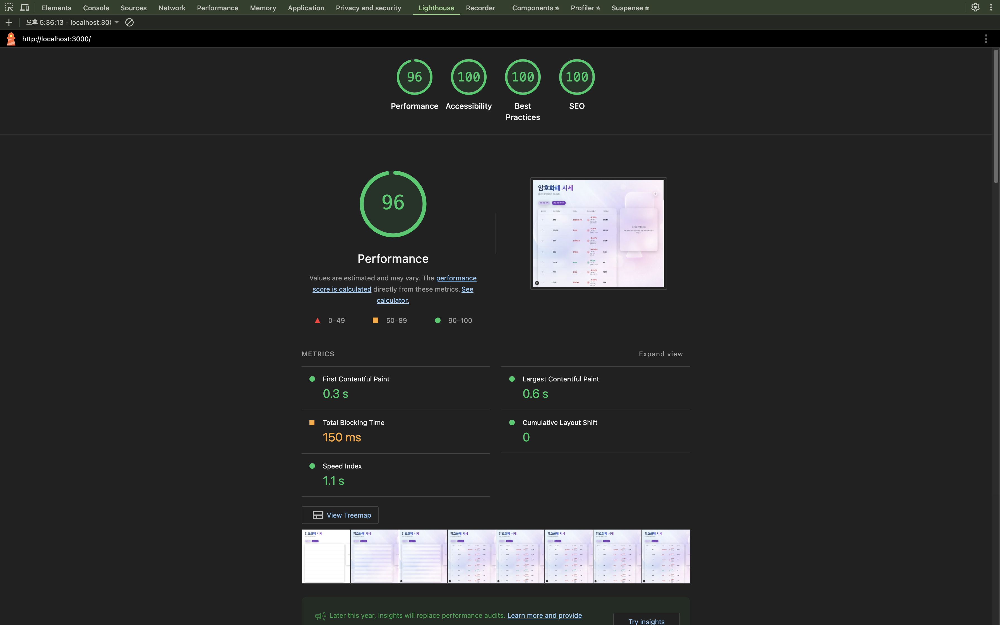
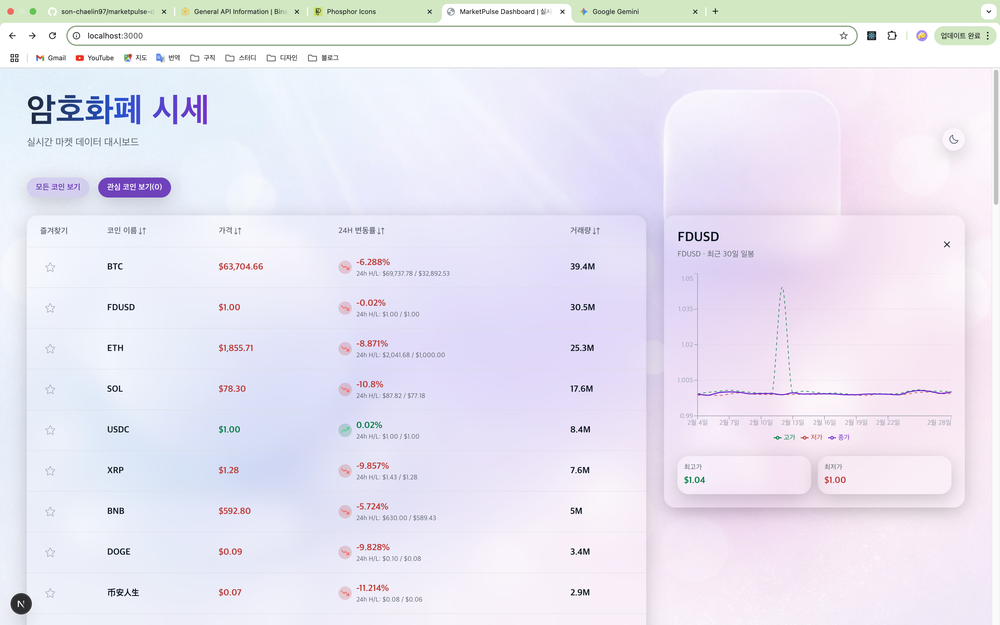
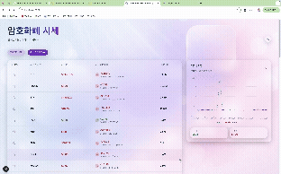

# 📈 MarketPulse Dashboard

> **실시간 암호화폐 마켓 데이터 대시보드** > **[🔗 실시간 데모 보러가기](https://marketpulse-dashboard-five.vercel.app/)**

실시간 암호화폐 마켓 데이터를 기반으로 한 **코인 시세 대시보드**입니다.  
Binance REST API로 초기 마켓 리스트를 로드한 뒤 **WebSocket 스트림**으로 실시간 시세를 갱신하며, 가격 / 변동률 / 거래대금 기준 **정렬**, **관심 목록**, **일봉 차트**를 제공합니다.

---

## 📸 스크린샷 & 성능

### Lighthouse (Desktop)
| Performance | Accessibility | Best Practices | SEO |
|-------------|---------------|----------------|-----|
| 96          | 100           | 100            | 100 |



### 라이트 모드


### 다크 모드


### 실시간 갱신 데모 (WebSocket)
가격·변동률이 실시간으로 갱신되는 모습입니다.



---

## 🔍 주요 기능

### 실시간 마켓 데이터
- **REST**: Binance 24hr Ticker API로 USDT 마켓 목록 초기 로드
- **WebSocket**: Binance `!ticker@arr` 스트림으로 실시간 시세 수신 → React Query 캐시 패치
- 연결 끊김 시 자동 재연결, 로딩 / 에러 / 빈 상태 UI 분리

### 마켓 리스트 UI
- 테이블 기반 마켓 리스트 (시맨틱 마크업, 키보드·스크린 리더 대응)
- 컬럼별 정렬: 코인명, 가격, 24시간 변동률, 거래대금
- 정렬 방향 3단계 토글 (내림차순 → 오름차순 → 해제)
- Top 50 선별 후 정렬, 모바일에서 거래대금 컬럼 숨김

### 관심 목록
- 즐겨찾기(별 아이콘)로 심볼 추가/제거
- Zustand + `persist` 미들웨어로 localStorage 영속화
- 필터: 전체 코인 / 관심 코인만 보기

### 일봉 차트
- 마켓 행 클릭 시 해당 코인 **최근 30일 일봉** 차트 표시
- Binance Klines API + Recharts(ComposedChart, Line)로 고가·저가·종가 라인 시각화
- 최고가·최저가 요약 카드, 차트 닫기(X) 버튼

### 테마
- **next-themes** 기반 라이트/다크 모드 전환
- 새로고침 시에도 테마 유지, hydration 깜빡임 방지

### UI/UX
- 스켈레톤 로딩(테이블·차트), 전역 에러 페이지, 빈 상태 안내
- 반응형 레이아웃, 글래스 모피즘 스타일

---

## 🛠 기술 스택

| 구분 | 기술 |
|------|------|
| 프레임워크 | Next.js 16 (App Router), React 19 |
| 언어 | TypeScript |
| 스타일 | Tailwind CSS v4 |
| 데이터·상태 | TanStack Query (서버 상태), Zustand (관심 목록·선택 마켓) |
| 실시간 | Binance REST API, WebSocket (`!ticker@arr`) |
| 차트 | Recharts |
| 테마 | next-themes |
| 테스트 | Jest, React Testing Library |

---

## 🧠 설계 포인트

- **서버 상태 vs 클라이언트 상태 분리**  
  - Query: 마켓 목록·캔들 데이터 fetching 및 캐시 (초기 로드 + WebSocket 패치)  
  - Zustand: 관심 목록, 선택된 마켓, 테마 등 클라이언트 전용 상태
- **정렬·필터는 클라이언트 처리**  
  - 정렬 기준 변경 시 재요청 없이 캐시된 배열만 변환 (Top 50, 정렬 방향)
- **접근성**  
  - 테이블 시맨틱, 정렬 버튼·`aria-sort`, 행 키보드 선택(Enter/Space), 버튼 `aria-label`

---

## 📌 현재 상태

- 마켓 리스트·정렬·관심 목록·필터 구현 완료
- WebSocket 실시간 티커 갱신 및 재연결 처리
- 마켓 선택 시 일봉 차트 표시 및 닫기
- 라이트/다크 테마 (next-themes)
- 스켈레톤·에러·빈 상태 UI
- 단위 테스트: `useFavoritesStore`, `useMarketListView` (Jest + RTL)
- 반응형·접근성 고려

---

## 🚀 실행 방법

```bash
# 의존성 설치
npm install

# 개발 서버 (http://localhost:3000)
npm run dev

# 프로덕션 빌드
npm run build && npm run start

# 단위 테스트
npm run test
```

---

## 🚧 향후 개선 예정

- 가상 스크롤로 대량 마켓 리스트 성능 개선
- 개별 마켓 상세 페이지
- API URL 등 환경 변수 분리 (`.env.example`)

---

## 📎 참고

이 프로젝트는 실시간 데이터 처리, WebSocket·React Query 연동, UI/상태 구조를 학습·정리하기 위한 **포트폴리오용** 프로젝트입니다.
